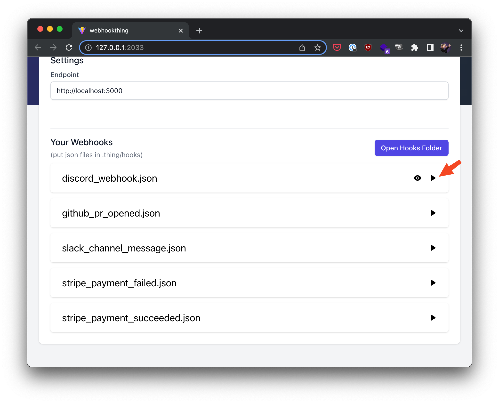

# Getting Started

In a fullstack or backend repo, run:

```bash
npx webhookthing
```

If your project doesn't have a `.thing/hooks` directory, a "download samples" button will be available to download some common defaults


This will create the `.thing/hooks` directory and add a set of example webhooks as .json files.

:::tip

We recommend committing these files to your repo so that they can be shared with your team.
:::

Once you have some json files in the `.thing/hooks` directory, you can run them against your local environment by pressing the "play" button



### Adding new webhooks

1. Open the `.thing/hooks` directory
2. Make a new `.json` file
3. Fill the `.json` file with the contents you want to have POSTed when you run the webhook

Your hook should now appear in the UI
